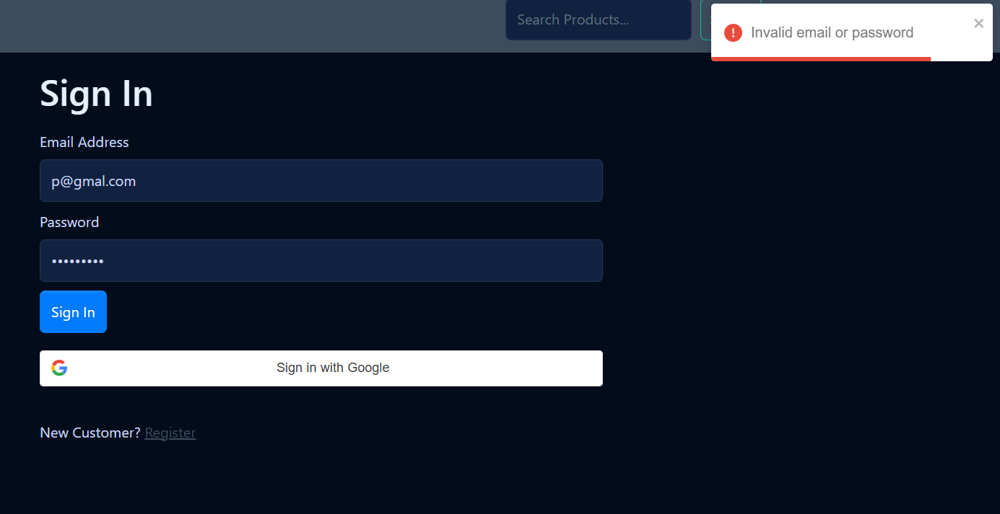

# 🧪 Manual Test Execution Report - Login Page

**Tester:** Sifat Ahmed
**Date:** December 14, 2025
**Module:** Authentication (Sign In)

---

### 1. Test Case: Empty Form Submission
**Scenario:** User clicks "Sign In" without entering any data.
**Expected Result:** System should block login and show an error.
**Actual Result:** ✅ PASS - "Invalid email or password" error displayed.

---

### 2. Test Case: Missing Password
**Scenario:** User enters a valid email but leaves the password field blank.
**Expected Result:** System should block login.
**Actual Result:** ✅ PASS - Error message displayed correctly.

---

### 3. Test Case: Missing Email
**Scenario:** User enters a password but leaves the email field blank.
**Expected Result:** System should block login.
**Actual Result:** ✅ PASS - Error message displayed correctly.

---

### 4. Test Case: Invalid Credentials
**Scenario:** User enters an email and password that do not match any account.
**Expected Result:** System should block login for security.
**Actual Result:** ✅ PASS - System rejected the login attempt.

